<p align="center">
  
</p>

A skill and a mod for Claude Code that turn the vague one-liners in your `.todo/tasks.md` backlog into designed features.

You jot ideas into `.todo/tasks.md` as they come, by hand or by asking Claude to add them, optionally with a mockup or screenshot. When you tell Claude to continue with one, it picks the item and sizes it up. A simple item is just implemented. For a big feature it suggests plan mode, and if you accept it interviews you about what the line leaves open and writes a plan you approve before any code is written. Finished items move from Queue to Done, tagged with the commit that implemented them.

The mod keeps that backlog in view while you work, with a pane, a band above the prompt and a status line entry, and lets you add items without leaving the prompt. Both read the same file and work on their own, so install either one or both.

## Install

### Mod

From a terminal session:

```
/plugin install todo --marketplace frangeris/todo
```

Answer `y` to add the marketplace, then pick a scope. To try it from a clone, run `claude --plugin-dir ./mod`. The mod is built on Claude Code's function hooks, an early access API that may change between releases.

### Skill

```sh
npx skills add frangeris/todo
```

To install it by hand instead, copy `SKILL.md` to `~/.claude/skills/todo-skill/SKILL.md`.

## Using the skill

1. Create a `.todo/` folder at the root of your project with a `tasks.md` inside it, holding a Queue and a Done section:

   ```md
   # Todo

   ## Queue

   - [ ] export the report as csv
   - [ ] dark mode 
   - [ ] retry failed syncs

   ## Done
   ```

2. Ask Claude to continue with an item, in your own words: "let's do the next one", "continue with the csv thing".
3. Claude quotes the item it picked and sizes it up. If it is simple, it implements it right away. If it looks like a big feature, it suggests plan mode and lets you choose between planning first or just implementing. Say "plan it" or "just do it" up front to skip the question.
4. If you accept plan mode, Claude asks questions until the feature is clear and writes a plan for you to approve.
5. Once the work is implemented and verified, the item moves to the top of Done, checked off and tagged with the short hash of the commit that implemented it: `- [x] retry failed syncs (a1b2c3d)`. With a plan, this is its last step. Without a commit, it moves without a hash.

If you drop or postpone an item, it stays in Queue.

### Images

Reference an image with regular markdown, inline on the item or on an indented line right below it. Keep the files in the `.todo/` folder, next to `tasks.md`, and write their paths relative to it. When Claude picks the item it opens the images and uses them as context for the interview. Remote URLs are not read.

### Adding items

Ask Claude to add an idea in your own words: "add to my todo: retry failed syncs". It inserts one `- [ ]` line per item at the end of Queue (creating the file if needed) and stops there, with no plan mode and no questions. Editing the file by hand works just as well.

To attach an image, give Claude a file path or drag the file in. It copies the file into `.todo/` and references it from the item. An image pasted into the chat has no file to copy, so Claude adds the text and asks for a path.

### Migrating from todo.txt

If a project has a `todo.txt` and no `.todo/tasks.md`, the skill converts it the first time it runs: every line becomes a task and `todo.txt` is deleted.

## Using the mod

Once it is installed there is nothing to set up. It reads `.todo/tasks.md` from the project root, picks up changes within a couple of seconds whether you or Claude made them, and stays out of the way when the project has no list.

- **Pane:** `/todo` opens a pane with a field to add items, the Queue and the latest Done items. The cursor starts in the field, and Esc gives the keys back to the prompt.
- **Band:** a line above the prompt with the next item and how many follow it, plus an Open button for the pane. It is hidden while the Queue is empty.
- **Status line:** a `todo: N` entry with the number of items in Queue.

### Adding items from the mod

Type `/todo add retry failed syncs`, write the text in the pane's field and press Enter, or use the shortcut and start the prompt with `# `:

```
# retry failed syncs
```

The item goes at the end of Queue, and the file is created if the project has none. An item already in Queue is not added twice. With the shortcut nothing is sent to the model. It only applies to a prompt you type that is a single line starting with `#` and a space, so a markdown heading with text under it still goes through as a prompt.

To attach an image, put its file path in the text: `/todo add dark mode ~/Desktop/mockup.png` or `# dark mode ~/Desktop/mockup.png`. The file is copied into `.todo/` and referenced inline on the item. Pasting an image into the chat is not handled yet.

The mod only shows and adds items. Picking one up and finishing it is the skill's job.
